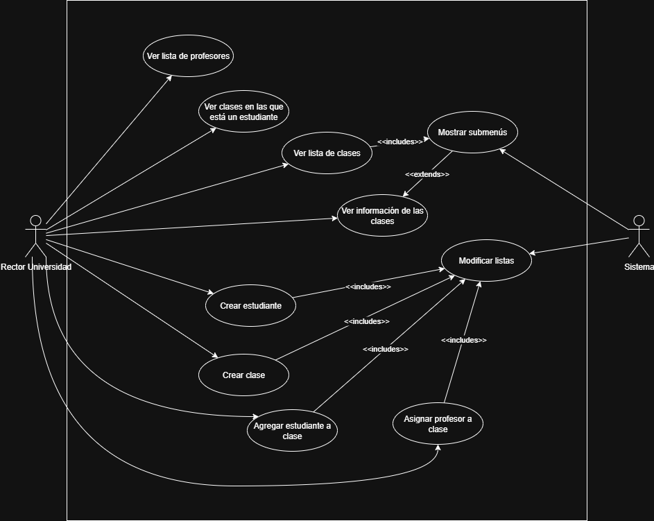
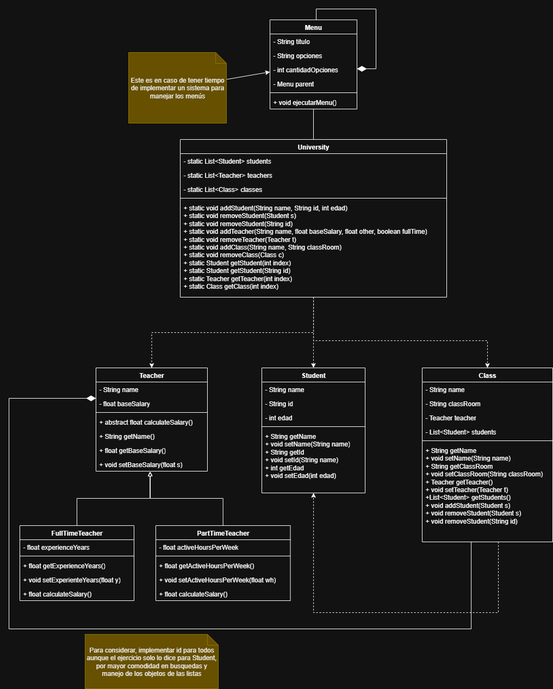

# Ejercicio final de java
En este repositorio se alojará el código del proyecto final de Java Basics

## Diagrama de casos de uso

## Diagrama de clases

## Información del respositorio
El respositorio tendrá una estructura básica, compuesta por ramas y tags:
### Ramas
#### Rama "main"
La rama main será la que tiene el código que mejor funciona e implementa funcionalidades completas
#### Rama "dev"
La rama dev contiene el código que está siendo desarrollado en cierto momento, los cambios de *dev* se mergean en *main* cuando alcanzan un estado decente (para este ejercicio hay demasiados criterios para hacer merge a *main*)
#### Feature Branches
Las feature branches son ramas que nacerán de *dev*, y su finalidad es separar mejor el desarrollo de nuevas funcionalidades, para que no todo se integre en *dev* de forma inmediata, esto tiene más utilidad para cuando hay mas gente colaborando, entonces en este caso las feature branches que haría serán por ejemplo "MenuSystem" dónde experimentaré con el sistema de menús que tengo en mente
### Tags
En este caso el repositorio se compondrá de tags simples, la idea es que se haga un Tag cada vez que se pasan los cambios de dev a main, como si fuera una versión "estable", he decidido llamar a los Tags Features_*<Nombre general de lo que se implementó>*
#### Tags actuales
* Features_ABC
* Features_ED
